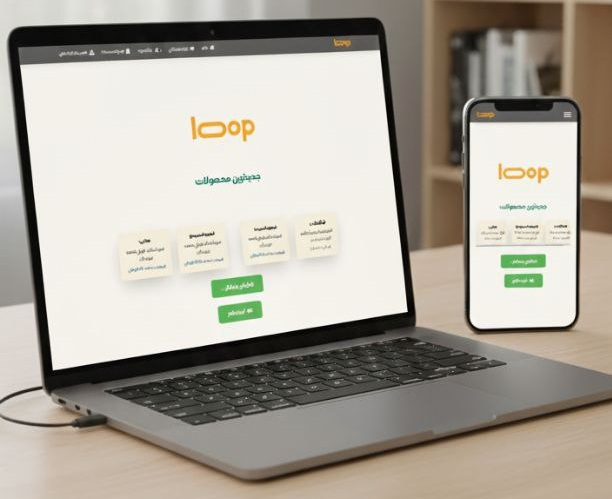

The **LOOP UI (Front-End)** is the **React.js frontend** for the LOOP platform.  
It provides a modern, responsive user interface built with **TailwindCSS**, and communicates with the **LOOP API** for data management (products, users, etc.).

---

## 📌 Technologies Used

- **Framework:** React.js  
- **Styling:** TailwindCSS  
- **Build Tool:** Create React App (CRA)  
- **Package Management:** npm 

---

## 📂 Project Structure

```bash
loop-ui/
├── package.json
├── tailwind.config.js
├── postcss.config.js
│
├── public/
│ ├── index.html
│ ├── manifest.json
│ ├── robots.txt
│ └── assets/
│
└── src/
├── assets/fonts/
├── components/
├── pages/
├── utils/
├── App.js
└── index.js
```

---



---

## 🔄 CI/CD

This project includes a **GitHub Actions** workflow for:  
- Running tests  
- Building the app  
- Deploying to hosting providers (e.g., Render, Liara or custom servers)  

Workflow configuration is stored in `.github/workflows/`.

---

## 📜 License

This project is licensed under the [Apache 2.0 License](LICENSE).

---

## 📬 Contact
Maintained by **Mohammad Malekzadeh**.  
Questions? Issues? Feature requests? Just open an issue or reach out via GitHub!